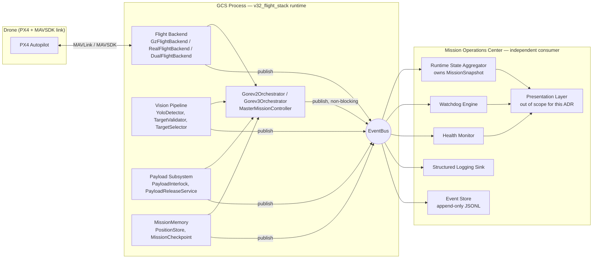
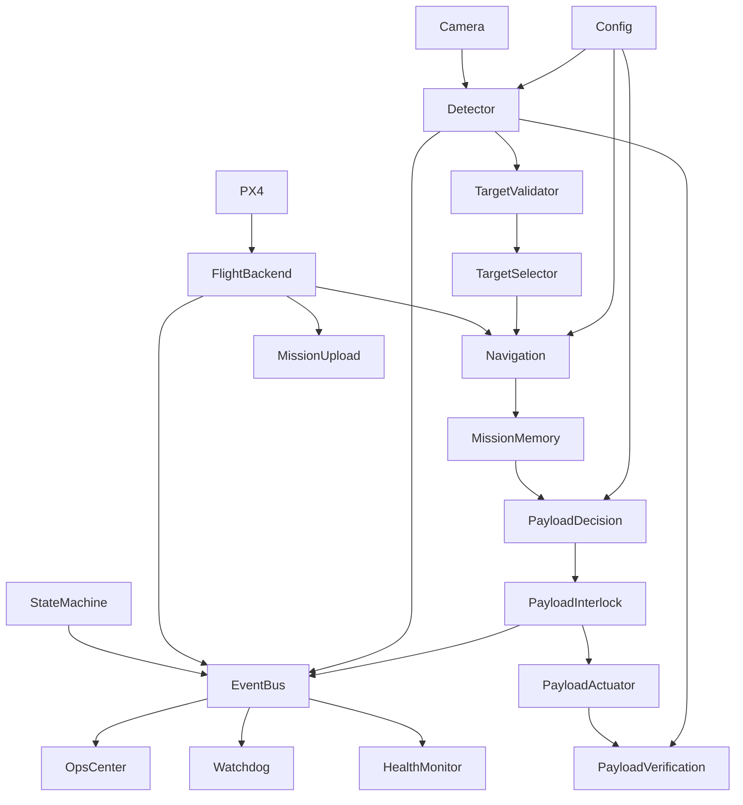

# ADR-004: KURSAD40 Mission Operations Center

**Status:** Proposed — architecture only, no implementation
**Owner:** Lead Software Architect / Principal UAV Systems Engineer
**Supersedes:** `core/telemetry/dashboard.py` (`Dashboard`), ad-hoc `logging`-only observability
**Applies to:** `v32_flight_stack` (Görev 2 + Görev 3 mission runtime)

---

## 0. Why this document exists

Twice in this engagement, the vehicle appeared to do nothing — "climbs to 15 m, then hovers" — for two **completely different root causes**:

1. `TargetValidator.is_validated()` required a condition (`is_navigating_to`) that no code path ever set — the detection→centering→drop pipeline was permanently unreachable, and nothing reported it.
2. `MavsdkBackendBase.upload_mission()` silently discarded the generated waypoints and uploaded an empty mission — PX4 had nothing to fly, and `is_mission_finished()` reported `True` immediately (0 == 0), skipping the entire mission loop.

In both cases: **no error, no warning, no log line said "the mission cannot proceed."** The system was in a state indistinguishable from normal operation. Diagnosing each took a full manual code trace — exactly what the current `Dashboard` (a synchronous `cv2.imshow` HUD bolted into the hot loop, `core/telemetry/dashboard.py`) cannot help with: it draws bounding boxes on video, nothing about mission state, blocking conditions, or subsystem health.

This ADR exists so the **next** silent failure — during a competition run, not a code review — is diagnosed by an operator looking at a screen in under 60 seconds, not by an engineer reading source code under time pressure.

---

## 1. System Philosophy

1. **No silent waits.** Every point where the mission runtime is blocked on a condition (sensor, subsystem, timer, external ack) must have a name, an owner, a start time, and — where applicable — a timeout. If the system is waiting, the operator is told *what* it is waiting for, not left to infer it from the absence of movement.
2. **State is a first-class object, not a side effect of control flow.** Today, "what phase is the mission in" is answerable only by knowing which line of `Gorev2Orchestrator.run()` the interpreter is currently executing. That is not observable at runtime. The mission state must be an explicit, queryable data structure that both drives control flow *and* is what the Ops Center reads — a single source of truth, not a UI reconstruction of logs.
3. **Observability is not logging.** Logging is one consumer of the event stream, not the mechanism itself. The runtime publishes structured events; logging, the Ops Center, replay, and analytics are independent subscribers to the same stream.
4. **The mission runtime must never block on the Ops Center.** The current `Dashboard.update()` calls `cv2.imshow` / `cv2.waitKey` synchronously inside the detection loop of `Gorev2Orchestrator.run()`. If a display window hangs, stalls, or isn't attached (headless field operation), the mission stalls with it. Telemetry publication must be fire-and-forget from the runtime's perspective.
5. **Every subsystem proves it is alive, not just that it hasn't crashed.** A component that stops producing output (camera frozen, detector stuck loading a model, MAVSDK connection silently dropped) is functionally identical to a failure and must be treated as one — via heartbeats and staleness detection, not exception handling alone.
6. **Design for the postmortem, not just the live view.** Every event is durable and replayable. A competition run's full mission history must be reconstructable after the fact, frame-numbered and time-aligned, without needing the aircraft.
7. **Minimal-diff integration.** The existing business logic (`Gorev2DurumMachine`, `PayloadInterlock`, `PositionStore`, etc.) is materially correct after the two bug fixes in this engagement and should not be rewritten to accommodate observability. Instrumentation is added at existing seams (dependency injection of a publisher), not by inverting control.

---

## 2. Scope & Non-Goals

**In scope:** runtime architecture for mission state, event streaming, health/watchdog monitoring, blocking-reason capture, logging, diagnostics, replay, and how the Mission Operations Center integrates with the existing `v32_flight_stack` modules.

**Explicitly out of scope for this document:** visual design, UI framework, React/Flutter/HTML, network transport security hardening, multi-vehicle swarm coordination (addressed only in §21 as a forward-compatibility note). No code is written here; every code identifier below refers to the **current, real** `v32_flight_stack` source so this document is falsifiable against the repository, not aspirational fiction.

---

## 3. Architecture Overview

The existing mandate (Görev 2 report) already splits the system into two runtimes: **drone** (flight control + Offboard execution only) and **GCS** (all vision processing). The Mission Operations Center is a **third logical role**, co-located with the GCS process (same machine, same MAVLink/vision authority), but architecturally independent of both:



Key property: the **left side (mission runtime) has an outbound-only edge to the EventBus.** Nothing in the Ops Center can call back into or block the mission runtime. This directly fixes the `cv2.waitKey`-in-the-hot-loop problem in the current `Dashboard`.

---

## 4. The Core Correction: Explicit Mission State

Today, mission "state" is implicit: `Gorev2Orchestrator.run()` is one long `async def` where progress is encoded as which `await` the coroutine is suspended on, plus a handful of local booleans (`gorev2_tamamlandi`, `current_state_text`). `Gorev2DurumMachine` (`core/mission/gorev2_fsm.py`) is *not* the mission state machine the Görev 2 report calls for ("ana `MissionManager` sınıfının state machine'i, 19 adım") — it only covers the DURUM-1..4 payload-priority decision. There is no object anywhere that answers "what phase is the mission in right now" without reading a log tail.

**Correction:** introduce an explicit `MissionPhase` enum and a `MissionContext` object that:

- Is mutated **only** through named transition calls (`context.transition_to(phase, reason)`), never through implicit control flow.
- Is the thing `Gorev2Orchestrator`/`Gorev3Orchestrator`/`MasterMissionController` hold and update — not a UI-side reconstruction.
- Is published to the EventBus on every transition and is queryable synchronously at any instant (`context.snapshot()`), independent of the event stream, so a late-attaching Ops Center instance can render current state without replaying history.

This single change is what makes "why isn't the drone moving" mechanically answerable: the answer is always `context.current_phase` + `context.blocking_reason` (§8), not a code trace.

---

## 5. Mission Lifecycle State Machine

Phases are the 19-step Görev 2 sequence extended with the Görev 3 phases that already exist in code (`gorev3_precondition.py`, `gorev3_pickup.py`, `gorev3_transport.py`, `gorev3_redrop.py`, `gorev3_finish.py`) plus explicit FAILURE/ABORT/TIMEOUT terminal states the current code has no concept of at all.

| # | Phase | Owning component (current) | Entry condition |
|---|---|---|---|
| 1 | `MISSION_INIT` | `main_gz.py` / `main_real.py` wiring | process start |
| 2 | `CONNECTING` | `MavsdkBackendBase.connect()` | `orchestrator.run()` called |
| 3 | `ARMING` | `MavsdkBackendBase.arm()` | connection established |
| 4 | `TAKEOFF` | `MavsdkBackendBase.takeoff()` | armed |
| 5 | `CLIMB_TO_ALTITUDE` | *(currently `asyncio.sleep(5.0)` — no real check, see §8)* | takeoff issued |
| 6 | `CHECKPOINT_SAVE` | `MissionCheckpoint.save()` | altitude phase complete |
| 7 | `MISSION_ROUTE_GENERATE` | `Gorev2Orchestrator._generate_square_mission()` | checkpoint saved |
| 8 | `MISSION_UPLOAD` | `MavsdkBackendBase.upload_mission()` | route generated |
| 9 | `MISSION_START` | `MavsdkBackendBase.start_mission()` | upload acked |
| 10 | `SEARCHING` (Mission mode, vision active) | main loop in `Gorev2Orchestrator.run()` | mission started |
| 11 | `TARGET_TRACKING` | `TargetValidator.is_track_ready()` | detection above confidence threshold |
| 12 | `SWITCH_TO_OFFBOARD` | `CenteringController.switch_to_offboard()` | track-ready |
| 13 | `GOTO_TARGET` / `CENTERING` | `CenteringController.go_to_and_center()` | offboard active |
| 14 | `HOVER_CONFIRM` | `CenteringController.hover_and_confirm()` | centered |
| 15 | `GPS_SAVE` | `PositionStore.try_save()` | hover complete |
| 16 | `PAYLOAD_DECISION` | `Gorev2DurumMachine.on_target_confirmed()` | GPS saved |
| 17 | `PAYLOAD_RELEASE` | `PayloadReleaseService.release_and_verify()` | DURUM-1/3/4 selected |
| 18 | `PAYLOAD_VERIFY` | `PayloadReleaseService` (marker re-detection) | release issued (best-effort, non-blocking) |
| 19 | `RETURN_TO_SECOND_TARGET` | DURUM-3 branch in `Gorev2Orchestrator.run()` | payload 1 released, target 2 already known |
| 20 | `GOREV2_COMPLETE` | `PayloadInterlock.both_released()` | both payloads released |
| 21 | `GOREV3_START` (hook) | `MasterMissionController.run()` → `Gorev3Orchestrator.run()` | Görev 2 complete, **Offboard not exited** |
| 22 | `GOREV3_PRECONDITION` / `PICKUP` / `TRANSPORT` / `REDROP` / `FINISH` | `gorev3_*.py` | sequential |
| 23 | `RETURN_TO_CHECKPOINT` | `Gorev3FinishPhase.run()` | Görev 3 finish phase |
| 24 | `LANDING` | `flight.land()` (`MasterMissionController.run()`) | checkpoint reached |
| 25 | `MISSION_COMPLETE` | terminal | landed |
| 26 | `MISSION_FAILED` | **does not exist today — must be added** | unrecoverable subsystem error |
| 27 | `MISSION_ABORTED` | **does not exist today** | operator-issued abort |
| 28 | `MISSION_TIMEOUT` | **does not exist today** — `GOREV2_MAX_FLIGHT_DURATION_S=600` is defined in `parameters.py` and never read anywhere | elapsed > 600s |

Every phase transition is a `MISSION_PHASE_CHANGED` event (§7). Phases 26–28 are new terminal states the current code cannot reach even in principle — flagged explicitly because "the drone just sits there forever" is currently a valid *unbounded* outcome of the state machine, not a bug that trips a boundary.

---

## 6. Runtime Data Model — `MissionSnapshot`

The single queryable object the Ops Center reads. Conceptually (field list, not code):

```
MissionSnapshot
├── mission_id, started_at, elapsed_s, timeout_budget_s, timeout_remaining_s
├── phase: MissionPhase                      # §5
├── phase_entered_at, phase_elapsed_s
├── blocking: BlockingState | null            # §8 — null means "not blocked"
│     ├── waiting_on: str                     # e.g. "MISSION_UPLOAD_ACK"
│     ├── owning_subsystem: str
│     ├── since: timestamp
│     ├── timeout_at: timestamp | null
│     └── last_known_cause: str | null
├── vehicle
│     ├── connected: bool, armed: bool, flight_mode: str
│     ├── position: {lat, lon, alt_rel_m}, position_age_s
│     ├── attitude: {yaw_deg}, gps_fix_type, ekf_status   # NOT currently read — gap, see §9.5
│     └── battery_pct, battery_voltage                    # NOT currently read — gap
├── mission
│     ├── checkpoint: {lat, lon, alt} | null
│     ├── route: [waypoints] | null, route_source: "internal-generated"
│     ├── uploaded: bool, upload_item_count: int           # exposes the exact class of bug found in §0
│     └── progress: {current_wp, total_wp}
├── vision
│     ├── detector_ready: bool                             # NOT currently exposed — YoloDetector._model may be None forever, silently
│     ├── last_frame_at, frame_age_s, effective_hz
│     ├── detections: [{shape_type, confidence, center_px}]
│     └── active_track: {shape_type, consecutive_frames, is_centered, is_navigating_to, altitude_ok} | null
├── targets
│     ├── selected: TargetPoint | null, other_temp_memory: Detection | null   # TargetSelector.temporary_memory
│     └── saved_points: [TargetPoint]                       # PositionStore.all_points()
├── payload
│     ├── interlock: {payload_1_released, payload_2_released, can_release_payload_2}
│     └── verification: {expected_marker, found: bool} | null
├── debounce: {shape_type: cooldown_remaining_s, ...}
├── health: HealthMatrix                                    # §10
├── watchdogs: [WatchdogState]                               # §19
└── recent_events: [Event]  (ring buffer, last N)
```

This is the object the diagnostic panel (§17) renders in full; every other view is a projection of it.

---

## 7. Event Model

### 7.1 Envelope (every event, no exceptions)

```
Event
├── event_id (ULID — sortable, unique)
├── ts (UTC, monotonic-safe)
├── mission_id
├── category: LIFECYCLE | TELEMETRY | VISION | NAVIGATION | PAYLOAD | HEALTH | WATCHDOG | LOG | OPERATOR
├── subsystem: str                    # e.g. "Gorev2Orchestrator", "TargetValidator", "MavsdkBackendBase"
├── severity: DEBUG | INFO | WARN | CRITICAL | FATAL
├── code: str                         # stable machine-readable code, e.g. "MISSION_UPLOAD_EMPTY"
├── message: str                      # human-readable, Turkish or English, operator-facing
├── correlation_id: str | null        # links a causal chain, e.g. one target-acquisition attempt end-to-end
└── data: object                      # structured payload, event-specific
```

`code` is the important field for tooling (filtering, alerting, replay diffing); `message` is for the operator. Every event that changes `MissionSnapshot` must also be replayable into it deterministically (§20).

### 7.2 Canonical event catalog (extends the example list; grounded in real code paths)

| Code | Category | Fires when | Source |
|---|---|---|---|
| `MISSION_STARTED` | LIFECYCLE | `MasterMissionController.run()` entry | new |
| `CONNECTED` | LIFECYCLE | `MavsdkBackendBase.connect()` sees `is_connected` | existing call, needs event |
| `ARMED` | LIFECYCLE | after `action.arm()` returns | existing |
| `TAKEOFF_ISSUED` | LIFECYCLE | `takeoff()` called | existing |
| `ALTITUDE_REACHED` | LIFECYCLE | **does not exist** — today is a blind `sleep(5.0)`; must become a real telemetry-driven check | gap |
| `CHECKPOINT_SAVED` | LIFECYCLE | `MissionCheckpoint.save()` | existing |
| `ROUTE_GENERATED` | NAVIGATION | `_generate_square_mission()` returns | existing |
| `MISSION_UPLOAD_REQUESTED` | LIFECYCLE | before `upload_mission()` call, include waypoint count | new |
| `MISSION_UPLOAD_CONFIRMED` | LIFECYCLE | after upload, **must assert `uploaded_item_count == requested_item_count`** — this single assertion would have caught the empty-mission bug at the source | new, critical |
| `MISSION_UPLOAD_MISMATCH` | LIFECYCLE / CRITICAL | uploaded count ≠ requested count | new, critical |
| `MISSION_STARTED_ONBOARD` | LIFECYCLE | `start_mission()` | existing |
| `MISSION_PROGRESS` | LIFECYCLE | on each `mission_progress()` tick | existing telemetry, needs event |
| `MISSION_FINISHED_UNEXPECTED` | WATCHDOG / CRITICAL | `is_mission_finished()==True` with 0 detections processed and elapsed < N seconds — **the exact signature of the bug in §0** | new |
| `DETECTION_MODEL_NOT_LOADED` | HEALTH / WARN | `YoloDetector._model is None` on a `detect()` call | new — currently silent |
| `DETECTION_FRAME_STALE` | HEALTH / WARN | frame age exceeds threshold | new |
| `DETECTION_RECEIVED` | VISION | any detection above threshold | existing logic, needs event |
| `DETECTION_BELOW_THRESHOLD` | VISION / DEBUG | detection filtered by confidence | new — currently invisible |
| `TARGET_DEBOUNCED` | VISION / DEBUG | `DebounceTracker.is_in_cooldown()==True` | existing logic, needs event |
| `TARGET_SELECTED` | VISION | `TargetSelector.select()` | existing |
| `TARGET_DEFERRED_TO_MEMORY` | VISION | other detection stored in `temporary_memory` | existing |
| `TRACK_READY` | VISION | `is_track_ready()==True` | existing (post-fix) |
| `OFFBOARD_SWITCH_REQUESTED` / `OFFBOARD_ACTIVE` | NAVIGATION | `switch_to_offboard()` / `start_offboard()` | existing |
| `CENTERING_STARTED` | NAVIGATION | `go_to_and_center()` entry | existing |
| `CENTERING_CONVERGED` | NAVIGATION | pixel error under tolerance | existing |
| `CENTERING_TIMED_OUT` | NAVIGATION / WARN | 30-attempt loop exhausted — **currently returns `False` and the caller discards the return value; the orchestrator proceeds as if centering succeeded** | gap, flagged critical below |
| `HOVER_STARTED` / `HOVER_CONFIRMED` | NAVIGATION | `hover_and_confirm()` | existing |
| `GPS_SAVE_REJECTED` | VISION / WARN | `try_save()` returns `None` (confidence/centered/hover precondition failed) | existing logic, needs event |
| `GPS_SAVE_CONFIRMED` | VISION | `try_save()` returns a `TargetPoint` | existing |
| `DURUM_1_TRIGGERED` … `DURUM_4_TRIGGERED` | PAYLOAD | `Gorev2DurumMachine.on_target_confirmed()` branches | existing logic, needs event |
| `PAYLOAD_RELEASE_REQUESTED` / `PAYLOAD_RELEASE_CONFIRMED` | PAYLOAD | `PayloadReleaseService.release_and_verify()` | existing |
| `PAYLOAD_VERIFICATION_FAILED` | PAYLOAD / WARN | marker not found post-drop (non-blocking) | existing logic, needs event |
| `INTERLOCK_VIOLATION_BLOCKED` | PAYLOAD / CRITICAL | `PayloadInterlock.mark_payload_2_released()` raises `RuntimeError` | existing — currently only a raised exception, must also be an event so it survives to the operator |
| `GOREV2_COMPLETE` | LIFECYCLE | `interlock.both_released()` | existing |
| `GOREV3_HOOK_INVOKED` | LIFECYCLE | `MasterMissionController` calls `gorev3.run()` | existing |
| `RETURN_TO_CHECKPOINT_STARTED` / `LANDING_STARTED` / `MISSION_COMPLETE` | LIFECYCLE | `Gorev3FinishPhase.run()`, `flight.land()` | existing |
| `MISSION_TIMEOUT_EXCEEDED` | WATCHDOG / CRITICAL | elapsed > `GOREV2_MAX_FLIGHT_DURATION_S` | new — config exists, no consumer today |
| `MISSION_ABORTED` | LIFECYCLE / OPERATOR | operator-issued | new |
| `SUBSYSTEM_HEARTBEAT_MISSED` | HEALTH / WARN→CRITICAL | see §10 | new |
| `WATCHDOG_FIRED` | WATCHDOG / CRITICAL | see §19 | new |

---

## 8. Blocking / Waiting Taxonomy

Every entry below is a **named, reportable `waiting_on` value** for `MissionSnapshot.blocking`, discovered by walking the actual call graph of `Gorev2Orchestrator.run()` and everything it calls — not a hypothetical list.

| `waiting_on` | Real code location | Current behavior if stuck | Required behavior |
|---|---|---|---|
| `WAITING_MAVSDK_CONNECTION` | `MavsdkBackendBase.connect()` — `async for state in connection_state()` | blocks forever, no timeout, no log until connected | timeout + `WATCHDOG_FIRED(code=CONNECTION_TIMEOUT)` |
| `WAITING_ARM_ACK` | `action.arm()` | MAVSDK raises on failure but nothing surfaces *why* PX4 refused (pre-arm checks) | capture PX4 arming-check failure reasons via `telemetry.health()` and attach to the event |
| `WAITING_ALTITUDE_REACHED` | **fixed `asyncio.sleep(5.0)`**, `gorev2_orchestrator.py:70` | not actually a wait condition at all — a guess; if takeoff is slow (wind, payload weight) the orchestrator proceeds anyway believing it's at 15 m | replace with a real poll of `get_global_position()` against `MISSION_ALTITUDE_M` with tolerance + timeout |
| `WAITING_MISSION_UPLOAD_ACK` | `upload_mission()` | **the exact bug in §0** — "success" with 0 items looks identical to success with 5 | assert item-count round-trip, emit `MISSION_UPLOAD_MISMATCH` on failure |
| `WAITING_MISSION_START_ACK` | `start_mission()` | no confirmation read back | confirm via `mission_progress()` total > 0 before declaring started |
| `WAITING_CAMERA_FRAME` | `camera.get_frame()` | no timeout, no staleness signal | frame-age watchdog (§19) |
| `WAITING_DETECTOR_MODEL_LOAD` | `YoloDetector.__init__` / `detect()` — `if self._model is None: return []` | **silent forever** — indistinguishable from "no targets in view" | `DETECTION_MODEL_NOT_LOADED` at startup and on every subsequent call while unset; block `SEARCHING` phase from being reported "nominal" while this is true |
| `WAITING_CONFIDENCE_THRESHOLD` | detections filtered at `conf < YOLO_CONFIDENCE_THRESHOLD` | invisible — operator sees nothing, doesn't know a shape is being seen but rejected | `DETECTION_BELOW_THRESHOLD` with actual confidence value |
| `WAITING_DEBOUNCE_COOLDOWN` | `DebounceTracker.is_in_cooldown()` | invisible | expose remaining cooldown per shape in snapshot |
| `WAITING_TRACK_READY` | `TargetValidator.is_track_ready()` (post-fix) | now reachable, but individual sub-conditions (tracked-frames / centered / altitude) aren't independently visible | expose the 3 booleans individually, not just the AND result |
| `WAITING_OFFBOARD_MODE_ACTIVE` | `start_offboard()` | PX4 can reject Offboard entry (e.g., no recent setpoint stream) with no surfaced reason | capture and surface PX4 mode-change rejection |
| `WAITING_CENTERING_CONVERGENCE` | `go_to_and_center()`, 30×0.1s attempts | **times out silently — returns `False`, caller ignores it and proceeds to `hover_and_confirm()` regardless** | this is a live bug-class identical in shape to §0; must raise/emit and block phase progression |
| `WAITING_HOVER_STABILIZATION` | `hover_and_confirm()`, fixed 2s | fine as a wait, just not reported | expose as a visible countdown |
| `WAITING_GPS_SAVE_PRECONDITION` | `PositionStore.try_save()` returns `None` | logged via `logger.warning`, not surfaced structurally | `GPS_SAVE_REJECTED` event with which precondition failed |
| `WAITING_PAYLOAD_INTERLOCK` | `PayloadInterlock.can_release_payload_2()==False` | this is *correct*, expected behavior (DURUM-2) — but must be distinguishable from a *stuck* wait | tag as `EXPECTED_WAIT` vs `BLOCKING_WAIT` in the taxonomy |
| `WAITING_PAYLOAD_ACTUATOR_ACK` | `RealPayloadActuator.release_payload_at_*` | currently always simulated (`await asyncio.sleep(0.5)`), no real hardware ack path exists yet | when hardware lands, actuator must report success/failure explicitly, not assume |
| `WAITING_PAYLOAD_VERIFICATION` | marker re-detection in `PayloadReleaseService` | correctly non-blocking per spec (Bölüm 13) — must render as "informational, not gating" | tag `EXPECTED_WAIT`, never escalate to watchdog |
| `WAITING_GOREV3_HOOK` | `MasterMissionController.run()` between `gorev2.run()` and `gorev3.run()` | fine | expose as an explicit phase transition, not a gap in the timeline |
| `WAITING_RETURN_TO_CHECKPOINT` | `Gorev3FinishPhase.run()` | placeholder `asyncio.sleep(2)`, not a real position-reached check | same class of gap as `WAITING_ALTITUDE_REACHED` |
| `MISSION_TIMEOUT_BUDGET` | not a wait on a subsystem, but the **outer bound on all waits** | `GOREV2_MAX_FLIGHT_DURATION_S` defined, never checked | top-level watchdog, §19 |

Two categories emerge and must be tagged distinctly in `BlockingState`:
- **`EXPECTED_WAIT`** — the system is correctly blocked by design (payload interlock before target 1 is dropped, debounce cooldown, non-blocking verification).
- **`BLOCKING_WAIT`** — the system is blocked and this is only acceptable up to a timeout, after which it is a fault.

The current codebase has **zero instances** of the second category actually enforcing a timeout, despite most of the individual wait points above having an implicit expectation of bounded duration. This is the single most important behavioral gap this ADR must close.

---

## 9. Subsystem Integration Matrix

For each subsystem: what it exposes today (or should), events published, metrics, warnings, errors, health check, dependencies, heartbeat.

### 9.1 Flight Backend (`IFlightBackend` → `GzFlightBackend` / `RealFlightBackend` / `DualFlightBackend` / `MavsdkBackendBase`)
- **Exposes:** connection state, armed state, flight mode, position (NED + global), attitude, mission progress.
- **Events:** `CONNECTED`, `ARMED`, `TAKEOFF_ISSUED`, `MISSION_UPLOAD_REQUESTED/CONFIRMED/MISMATCH`, `MISSION_PROGRESS`, `OFFBOARD_ACTIVE`, `MODE_CHANGE_REJECTED` (new).
- **Metrics:** telemetry update rate, command round-trip latency (`arm()`/`goto_position_ned()` call → effect observed), position age.
- **Warnings:** telemetry stale > 2s, position jump > threshold between samples.
- **Errors:** connection lost mid-mission, arm rejected, mode-change rejected, mission upload count mismatch.
- **Health check:** last telemetry sample age < 1s (configurable); connection state == connected.
- **Dependencies:** MAVSDK ↔ PX4 (real) or Gazebo SITL (sim).
- **Heartbeat:** MAVLink heartbeat already exists at the protocol level — **currently not read or surfaced by `MavsdkBackendBase` at all** (`drone.telemetry.health()` is never called anywhere in the codebase). This is a concrete gap: EKF/GPS-fix/pre-arm-check status is available from MAVSDK today and simply isn't consumed.

### 9.2 Vision Pipeline (`YoloDetector`, `TargetValidator`, `TargetSelector`)
- **Exposes:** model-loaded state, per-frame detections, per-shape tracking state (`consecutive_frames`, `is_centered`, `is_navigating_to`, `altitude_ok`), selection outcome, temporary-memory contents.
- **Events:** `DETECTION_MODEL_NOT_LOADED`, `DETECTION_RECEIVED`, `DETECTION_BELOW_THRESHOLD`, `TARGET_SELECTED`, `TARGET_DEFERRED_TO_MEMORY`, `TRACK_READY`.
- **Metrics:** effective processing Hz (must be validated against the config bounds `CAMERA_PROCESS_FREQ_HZ_MIN/MAX = 10/30` — **currently unmeasured**), detection confidence distribution, frames without detections (streak).
- **Warnings:** Hz outside configured bounds, model not loaded > N seconds after start, frame age stale.
- **Errors:** detector raises an exception (currently would propagate and crash the loop with no health signal beforehand).
- **Health check:** model loaded AND last frame processed within staleness window.
- **Dependencies:** `ICameraSource`.
- **Heartbeat:** one per processed frame; absence of heartbeat for > staleness window ⇒ `SUBSYSTEM_HEARTBEAT_MISSED`.

### 9.3 Navigation / Visual Servo (`CenteringController`)
- **Exposes:** current pursuit target, pixel error (x/y), convergence state, offboard-active state, gain values (`kp_horizontal`, `kp_vertical` — currently placeholders per the `TODO[KONTROL]` in `centering_controller.py`).
- **Events:** `OFFBOARD_SWITCH_REQUESTED`, `CENTERING_STARTED`, `CENTERING_CONVERGED`, `CENTERING_TIMED_OUT` (must become blocking, see §8), `HOVER_STARTED/CONFIRMED`.
- **Metrics:** time-to-converge, pixel error trend, number of "target lost during centering" recoveries.
- **Warnings:** target lost transiently during centering (already logged, needs event).
- **Errors:** centering times out (currently silent, §8).
- **Health check:** N/A when idle; while active, must be making progress (error decreasing) or it's a fault, not just a timeout.
- **Dependencies:** `IFlightBackend`, `IDetector`, `ICameraSource`.
- **Heartbeat:** one per centering-loop iteration while active.

### 9.4 Payload Subsystem (`PayloadInterlock`, `PayloadReleaseService`, `IPayloadActuator` impls)
- **Exposes:** interlock state (`payload_1_released`, `payload_2_released`), release-in-progress state, verification outcome.
- **Events:** `DURUM_1..4_TRIGGERED`, `PAYLOAD_RELEASE_REQUESTED/CONFIRMED`, `PAYLOAD_VERIFICATION_FAILED`, `INTERLOCK_VIOLATION_BLOCKED`.
- **Metrics:** release latency, verification success rate.
- **Warnings:** verification marker not found (non-blocking by spec).
- **Errors:** `PayloadInterlock.mark_payload_2_released()` raising `RuntimeError` — this is the interlock working *correctly*; it must never be silently swallowed by a broad `except`, and must be a `CRITICAL` event, not just an exception.
- **Health check:** actuator responsive (currently always true — simulated); once hardware lands, actual servo-position feedback becomes the health check.
- **Dependencies:** `IDetector`, `ICameraSource` (for verification), `IPayloadActuator`.
- **Heartbeat:** N/A (event-driven, not continuous).

### 9.5 MissionMemory (`PositionStore`, `MissionCheckpoint`)
- **Exposes:** all saved `TargetPoint`s, checkpoint coordinates, save/rejection history.
- **Events:** `CHECKPOINT_SAVED`, `GPS_SAVE_CONFIRMED`, `GPS_SAVE_REJECTED`.
- **Metrics:** save rejection rate (proxy for detection/centering quality).
- **Warnings:** checkpoint not saved before mission route begins — currently a hard `RuntimeError` from `MissionCheckpoint.get()`, correct behavior, but must also be a `CRITICAL` event so an operator watching the Ops Center (not a stack trace) sees it.
- **Errors:** JSON write failure (`PositionStore._save_to_file()` already catches and logs — needs an event too, currently silent to anything but the log file).
- **Health check:** storage path writable.
- **Dependencies:** filesystem.
- **Heartbeat:** N/A.

### 9.6 Search Planner (does not exist as a named component today)
`Gorev2Orchestrator._generate_square_mission()` is a private method embedded in the orchestrator, not an independent, testable, observable component. **Recommendation: extract it** into a `SearchPlanner` class with its own interface (`generate(center, size) -> list[Waypoint]`), so route generation can be:
- Observed independently (`ROUTE_GENERATED` event with the actual waypoint list, not just implied by upload).
- Swapped later (e.g., a QGC-sourced polygon strategy) **without** touching `Gorev2Orchestrator` — this is also the correct place to have implemented Hypothesis A from the prior investigation, had it been the real design; today it deliberately is not, and this ADR does not propose adding QGC dependency, only structural room for it later.

### 9.7 Configuration (`core/config/parameters.py`)
- **Exposes:** every mission constant, as a versioned snapshot attached to `mission_id` at startup (so replay/postmortem knows exactly which thresholds were active).
- **Events:** `CONFIG_LOADED` (new) with a hash of the effective config.
- **Warnings:** any `None`-valued TODO parameter (`NORMAL_MISSION_SPEED_M_S`, `GOREV3_TRANSIT_SPEED_M_S`) still unset at mission start for a phase that needs it.
- **Health check:** all required-for-current-phase parameters are non-`None`.

### 9.8 Logging (`core/telemetry/mission_logger.py`)
Currently: unstructured text to console + a single per-run file, no correlation IDs, three logger names (`core`, `real_system`, `gz_system`) that don't map to the actual subsystem granularity above. Superseded by §16.

### 9.9 State Machine (`Gorev2DurumMachine`, and the missing `MissionPhase`/`MissionContext` from §4–5)
- **Exposes:** current phase, phase history, DURUM decision outcomes.
- **Events:** `MISSION_PHASE_CHANGED` (new, fires on every transition — this is the backbone event the Ops Center's primary view is built from).
- **Health check:** phase has advanced within its own expected max-duration (a per-phase watchdog, §19).

---

## 10. Health Model

Every subsystem in §9 reports one of:

| State | Meaning |
|---|---|
| `HEALTHY` | heartbeat/output within expected cadence, no active warnings |
| `DEGRADED` | operating but outside nominal parameters (e.g., detection Hz below 10) |
| `STALE` | expected heartbeat missed once, within grace period |
| `DOWN` | heartbeat missed beyond grace period, or a required dependency reports `DOWN` |
| `UNKNOWN` | not yet initialized / no data received since mission start |

`HealthMatrix` (part of `MissionSnapshot`) is subsystem → state, computed by the Health Monitor purely from event timestamps and declared cadences — it does not require subsystems to explicitly self-report "I am healthy," only to keep emitting their normal events on schedule. A subsystem going silent is itself the signal.

Dependency propagation: if `Flight Backend` is `DOWN`, everything downstream (`Navigation`, `Payload`) is forced to `DOWN` regardless of their own last-heartbeat, because their outputs are meaningless without it. This requires the dependency graph in §11 to be encoded, not just documented.

---

## 11. Dependency Graph



This graph is what makes health propagation (§10) and blocking-reason attribution (§8) mechanical rather than guesswork: if `Navigation` is stuck, the Ops Center walks *up* this graph (not down) to find the first `DOWN`/`STALE` ancestor and reports that as the root cause, not the symptom.

---

## 12. Observability Architecture — EventBus

- **Transport (v1):** in-process `asyncio.Queue`-based pub/sub, one publisher (the mission runtime, single process per the existing GCS-side deployment), multiple subscribers (Aggregator, Health Monitor, Watchdog Engine, Logging Sink, Event Store). No network hop required initially — the runtime and the Ops Center already share the GCS host per the original Görev 2 mandate.
- **Publish contract:** `publish(event)` is synchronous-to-call, asynchronous-to-deliver — `Queue.put_nowait` semantics, bounded queue with drop-oldest-and-count-drops policy so a slow subscriber (e.g., a laggy presentation layer) cannot ever back-pressure the mission runtime. A `EVENTBUS_BACKPRESSURE_DROPPED` meta-event is emitted when this occurs, so drops are themselves observable.
- **Delivery guarantee:** at-least-once to each subscriber within the process; the Event Store subscriber is the durability boundary (§20) — anything written there is the system of record for replay, independent of whether live subscribers were attached.
- **Why not a broker (Redis/Kafka/MQTT) in v1:** current deployment is single-process, single-host, single-vehicle. A broker adds a failure mode (broker down ⇒ blind mission) with no present benefit. §21 revisits this for multi-vehicle/remote-viewer scenarios.

---

## 13. Mission Operations Center Architecture (non-UI)

Three internal roles, each an independent EventBus subscriber, each individually restartable without affecting the mission runtime or each other:

1. **Runtime State Aggregator** — folds the event stream into the live `MissionSnapshot` (§6). This is the only component allowed to mutate the snapshot; everything else reads it.
2. **Watchdog Engine** — owns all timers from §19, independent of the Aggregator, so a frozen Aggregator cannot mask a watchdog firing.
3. **Health Monitor** — computes `HealthMatrix` (§10) from heartbeat cadence, independent of both.

A **Presentation Layer** (explicitly out of scope) is the only piece that would eventually become "the dashboard" — it reads `MissionSnapshot` + subscribes to live events + queries the Event Store for history. It has zero business logic: no subsystem should ever require the Presentation Layer to be running to function correctly, satisfying philosophy point 4.

**Auto-open requirement:** "RUN MISSION" issuing the mission-start command is itself the first `MISSION_STARTED` event; the launcher that issues that command is responsible for also starting/focusing the Ops Center process — this is a process-supervision concern (out of scope here) but the *architectural* hook is that `MISSION_STARTED` is unambiguous and machine-detectable the instant it happens, not inferred from telemetry.

---

## 14. Integration Architecture (how existing modules change)

Minimal-diff, per philosophy point 7:

- Every constructor in `core/mission/*`, `core/navigation/*`, `core/detection/*`, `core/interfaces/*`-implementing classes gains one injected dependency: a `publisher: EventPublisher` (interface, default no-op implementation so tests and the mock backends in `tests/mocks/` require zero changes).
- Existing `logger.info(...)`/`logger.warning(...)` call sites are **not deleted** — each is paired with a `publisher.publish(Event(...))` call carrying the same information structurally. This is a mechanical, low-risk change: every one of the ~40 log call sites audited in §7.2/§8 becomes exactly one additional line.
- `Gorev2Orchestrator.run()` gains explicit `context.transition_to(MissionPhase.X, reason=...)` calls at each of the boundaries in §5's table — replacing the current `current_state_text` string (which exists only for the old `Dashboard`'s HUD text and is not used anywhere else).
- `MissionCheckpoint`, `PayloadInterlock`, `PositionStore` — no logic changes; they gain publish calls at their existing raise/return points only.
- `MavsdkBackendBase.upload_mission()` — beyond the functional fix already applied, gains the item-count assertion from §7.2 (`MISSION_UPLOAD_CONFIRMED` / `MISSION_UPLOAD_MISMATCH`) as the concrete, permanent regression guard for the bug class found in §0.
- `CenteringController.go_to_and_center()` — return value must stop being discarded by the caller; timeout becomes a `BLOCKING_WAIT` (§8), not a silently-ignored `False`.

---

## 15. Logging Architecture

Replaces `mission_logger.py`'s three flat loggers:

- **Structured, not string-formatted:** log records are the same `Event` objects from §7, serialized as JSON Lines — one subscriber of the EventBus (§12) *is* the file logger. No separate logging call sites; logging becomes a projection of the event stream, eliminating the current risk of log text and actual state drifting apart (which is exactly what happened in both bugs in §0 — the code "looked" like it was working from its logs).
- **Correlation:** every event carries `mission_id` and, where applicable, `correlation_id` (e.g., one full target-acquisition attempt, from `TRACK_READY` through `GPS_SAVE_CONFIRMED`/`GPS_SAVE_REJECTED`, shares one `correlation_id`), so a postmortem can filter to "everything that happened while pursuing target #2" in one query.
- **Levels map to `severity`** in the event envelope; per-subsystem level filtering is a subscriber-side concern (a human tailing the console wants `INFO+`, the Event Store keeps everything including `DEBUG`).
- **Retention:** one JSONL file per `mission_id` (not per process-restart timestamp as today), rotated only by mission boundary, so a single file is always "everything that happened in this flight."

---

## 16. Diagnostic Architecture — the 60-second rule

The Presentation Layer (future work) must be able to render, from `MissionSnapshot` alone, a single "Blocking Reason Panel" answering, without log-reading:

1. **Current phase** and how long it's been in that phase vs. the expected max for that phase.
2. **`blocking`**, if non-null: what it's waiting on, which subsystem owns it, how long, and remaining time to timeout.
3. **`HealthMatrix`**, filtered to non-`HEALTHY` entries only.
4. **Active watchdogs** (§19) and their remaining time.
5. **Last 10 events**, most recent first, severity-colored (presentation detail, not specified further here).
6. **Interlock state**, always visible regardless of phase (it's the single most safety-critical piece of state in the system).

This is the panel that would have shown, in the §0 incidents:
- *Bug 1 (is_navigating_to deadlock):* phase stuck at `TARGET_TRACKING`, far past expected duration, `blocking.waiting_on = WAITING_TRACK_READY`, with the three sub-conditions individually visible showing `is_navigating_to: false` never flipping — immediately pointing at the exact missing call.
- *Bug 2 (empty mission upload):* `MISSION_UPLOAD_CONFIRMED` never fires (or fires with `upload_item_count: 0` against `requested_item_count: 5` once the assertion in §7.2 exists) — a mismatch event with both numbers in it, visible in under 5 seconds.

---

## 17. Recovery Architecture

| Failure class | Auto-retry? | Escalation path |
|---|---|---|
| Transient telemetry gap (< staleness threshold) | n/a, not a failure | none |
| Camera frame drop (single) | yes, next frame | `DEGRADED` health only if sustained |
| Detector exception on a single frame | yes, skip frame, continue | `WARN` event; `CRITICAL` if N consecutive |
| Centering timeout | **no auto-retry into the same pursuit** — re-enter `SEARCHING`, let debounce/track-ready re-qualify naturally | `WARN` event, one retry budget per target before `CRITICAL` |
| Mission upload mismatch | one retry of `upload_mission()` | `CRITICAL` + abort mission-start if second attempt also mismatches — never silently proceed on an unverified upload again |
| Interlock violation attempt | **never auto-retried, never silently caught** | `CRITICAL`, mission continues (the interlock already prevented the unsafe action) but the event must reach the operator |
| Connection loss mid-mission | reconnect attempts with backoff, bounded | `CRITICAL` + `MISSION_ABORTED` if unrecovered within budget |
| Mission timeout (§19) | no | `CRITICAL`, safe-state trigger (§19) — the response itself (RTL vs. hold vs. continue-to-nearest-safe-phase) is a team policy decision (Açık Nokta C in the original spec), not resolved by this ADR |

Principle: **retries are only ever applied to idempotent, non-safety-critical operations.** Anything touching the payload interlock or an armed/Offboard state transition escalates instead of retrying blindly.

---

## 18. Watchdog Architecture

| Watchdog | Trigger threshold | Scope | Action on fire |
|---|---|---|---|
| `MISSION_TIMEOUT` | `GOREV2_MAX_FLIGHT_DURATION_S` (600s, already configured) | whole mission | `CRITICAL` event; per Açık Nokta C, currently policy is log/warn only — this ADR keeps that policy but makes it *actually fire*, closing the existing dead-config gap |
| `PHASE_MAX_DURATION` | per-phase budget (new config, one entry per `MissionPhase`) | current phase | `WARN` at 80% of budget, `CRITICAL` at 100% |
| `TELEMETRY_STALENESS` | 1–2s, configurable | Flight Backend | `HealthMatrix` → `STALE`/`DOWN`; `CRITICAL` if sustained mid-mission |
| `DETECTION_STALENESS` | based on `1/CAMERA_PROCESS_FREQ_HZ_MIN` | Vision | same pattern |
| `CENTERING_CONVERGENCE` | existing 30×0.1s budget, made into a real watchdog instead of a silently-discarded `False` | Navigation | `WARN` → return to `SEARCHING` |
| `MISSION_UPLOAD_ACK` | e.g. 5s | Flight Backend | `CRITICAL` if no confirmed item-count match |
| `CONNECTION_ESTABLISH` | e.g. 15s | Flight Backend | `CRITICAL`, mission cannot proceed past `CONNECTING` |
| `HEARTBEAT_MISSED` (generic, per subsystem) | subsystem-declared cadence × grace multiplier | any | `SUBSYSTEM_HEARTBEAT_MISSED`, feeds `HealthMatrix` |

Every watchdog is itself represented in `MissionSnapshot.watchdogs` while armed, with remaining time — this is what makes them *visible* rather than just functional; an operator can see a watchdog counting down before it fires, not just after.

---

## 19. Mission Replay Capability

Because the Event Store (§12, §15) is an append-only, ordered, complete JSONL record per `mission_id`, replay is: read the file, feed events through the same `MissionSnapshot`-folding logic the live Aggregator uses (§13), at either recorded real-time pacing or accelerated. This guarantees replay and live view are **the same code path** rendering the same data structure — there is no separate "replay renderer" to keep in sync, eliminating an entire class of "replay doesn't match what actually happened" bugs. This directly serves competition post-run debrief: reconstruct exactly what the state machine believed at every second of the flight, including every blocking condition it passed through, without the aircraft present.

---

## 20. Metrics & Analytics

Derived entirely from the event stream, computed by a separate (optional, non-blocking) analytics subscriber:

- Mission phase durations (actual vs. budgeted, §19 watchdog config) — trend across competition attempts.
- Detection effective Hz vs. the 10–30 Hz spec band — currently unmeasured; this closes that gap.
- Confidence score distribution of accepted vs. rejected detections — informs whether `YOLO_CONFIDENCE_THRESHOLD=0.70` is well-calibrated.
- Centering convergence time distribution.
- Time from `TRACK_READY` to `GPS_SAVE_CONFIRMED` (full pursuit latency) — the single most useful competition-performance number.
- Payload release latency and verification success rate.
- EventBus drop count (§12) — a non-zero value here is itself an operational health signal about the Ops Center's own capacity.

---

## 21. Future Scalability

- **Multi-vehicle:** `mission_id` is already vehicle-scoped; extending to a fleet means the EventBus transport (§12) moves from in-process to a lightweight local broker (still on the GCS host — the vision-processing mandate already centralizes multiple vehicles' GCS-side compute today if that's ever the direction), with `vehicle_id` added to the event envelope. Nothing in §5–§10's data model changes shape, only cardinality.
- **Remote viewing:** if a remote viewer is ever required (e.g., a judge-facing display separate from the operator's GCS laptop), the Event Store (§15/§19) already being a durable, ordered log makes a simple tail-and-forward bridge sufficient — no redesign of the runtime.
- **SearchPlanner strategies:** §9.6's extraction is what allows a future QGC-sourced polygon strategy, or a coverage-optimized planner, to be added without touching orchestration or observability at all.

---

## 22. Summary of Required Changes (traceable to this document)

| Gap | Section | Severity |
|---|---|---|
| No explicit `MissionPhase`/`MissionContext` | §4, §5 | Architectural root cause |
| `upload_mission()` has no confirmation/assertion of uploaded content | §7.2, §8, §14 | Already caused one production-blocking bug this session |
| `CenteringController.go_to_and_center()` timeout return value discarded | §8, §9.3, §17 | Same bug class, not yet triggered but live |
| `asyncio.sleep(5.0)` used as a fake "altitude reached" wait | §5 (#5), §8 | Same bug class |
| `YoloDetector` silent `None`-model no-op | §8, §9.2 | Indistinguishable from "no targets present" |
| `GOREV2_MAX_FLIGHT_DURATION_S` defined, never enforced | §18 | Dead safety config |
| No EKF/GPS-fix/pre-arm health data consumed from MAVSDK at all | §9.1 | Available today, unused |
| `Dashboard` blocks the mission event loop via synchronous `cv2` calls | §0, §1, §13 | Architectural, being replaced by this ADR |
| No distinction between expected vs. faulty waits anywhere | §8 | Root cause of "why isn't it moving" ambiguity |

This table is the acceptance criteria for calling this architecture "implemented": every row must have a corresponding closed change before this ADR moves from Proposed to Accepted/Implemented.
